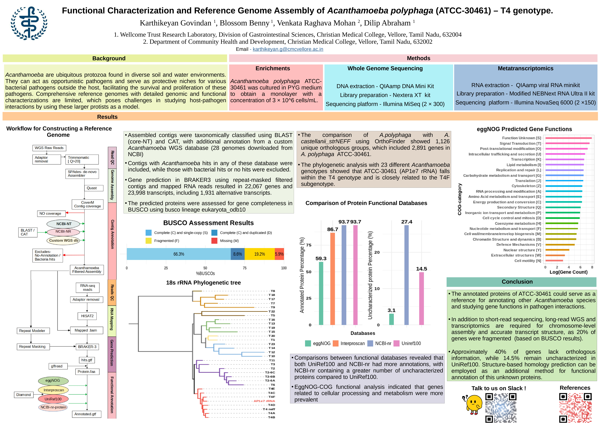
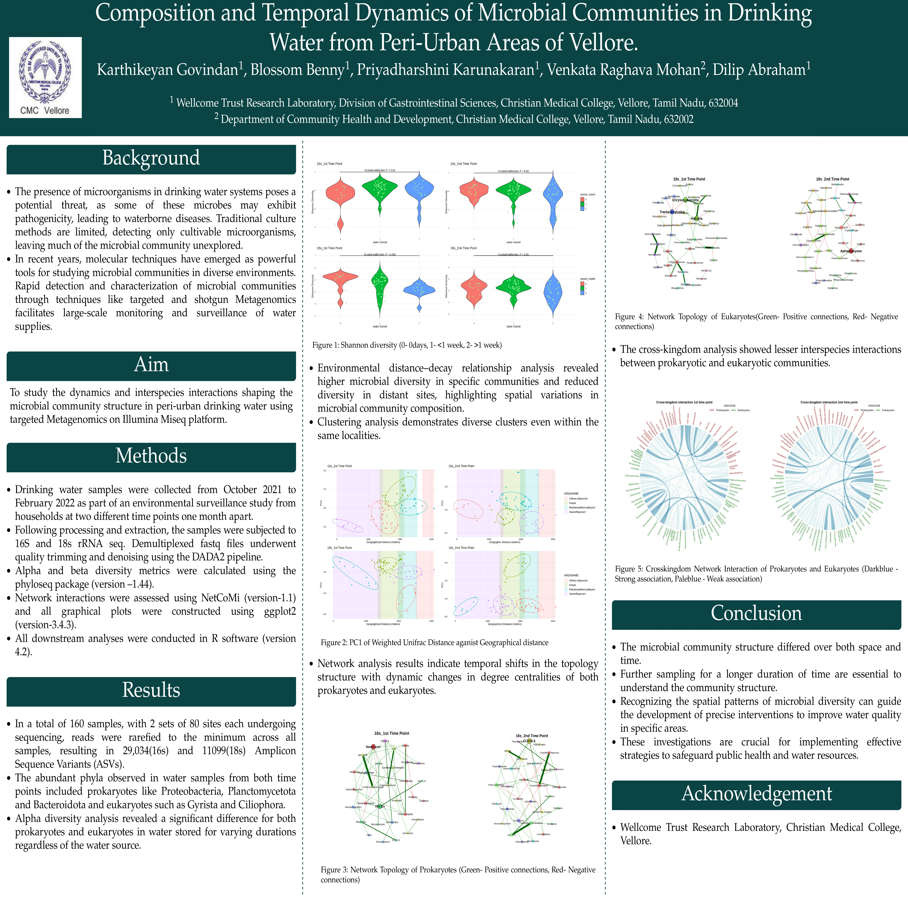

## Conference Posters

:::{.poster-grid}

:::{.poster-card}

:::{.poster-preview}

:::

:::{.poster-title}
Chromosome scale reference genome model - Acanthamoeba polyphaga (ATCC-30461) – T4 genotype
:::

:::{.poster-venue}
Understanding Life: Using Largescale Biodiversity Reference Genomes, Wellcome Connecting Science, Hinxton, Cambridge, United Kingdom · 2025
:::

:::{.poster-links}
[[View PDF](posters/poster1.pdf)]{.pub-link}
[[Download](posters/poster1.pdf)]{.pub-link}
:::

:::

:::{.poster-card}

:::{.poster-preview}

:::

:::{.poster-title}
Functional Characterization and Reference Genome Assembly of Acanthamoeba polyphaga (ATCC-30461) – T4 genotype
:::

:::{.poster-venue}
Biodiversity Genomics (BG)-2024, Wellcome Connecting Science · 2024 (Online)
:::

:::{.poster-links}
[[View PDF](posters/poster2.pdf)]{.pub-link}
[[Download](posters/poster2.pdf)]{.pub-link}
:::

:::

:::{.poster-card}

:::{.poster-preview}

:::

:::{.poster-title}
Composition and Temporal Dynamics of Microbial Communities in Drinking Water from Peri-Urban Areas of Vellore
:::

:::{.poster-venue}
Winter Symposium, Christian Medical College, Vellore, Tamil Nadu, India · 2024
:::

:::{.poster-links}
[[View PDF](posters/poster3.pdf)]{.pub-link}
[[Download](posters/poster3.pdf)]{.pub-link}
:::

:::

:::